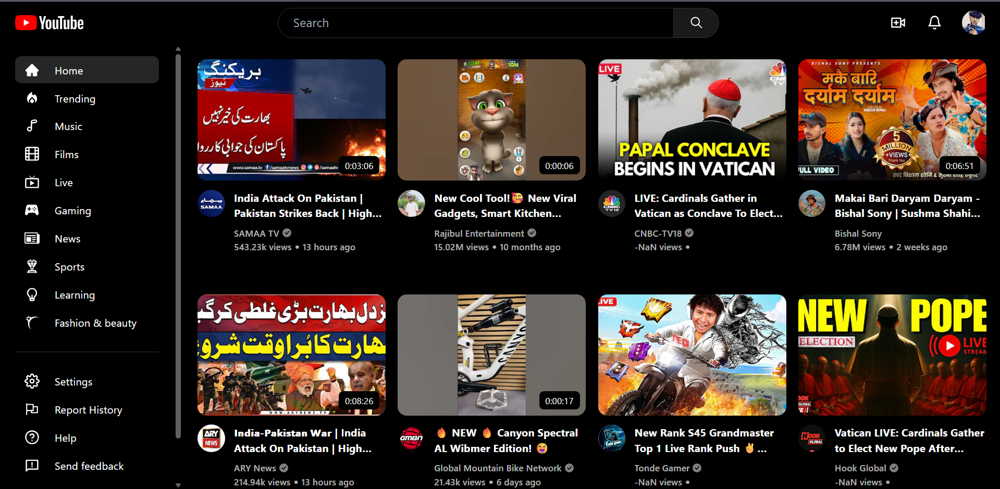

# YouTube Clone - React Application



A fully functional YouTube clone built with React, Tailwind CSS, and powered by the YouTube RapidAPI. This application replicates core YouTube features including video browsing, search functionality, category filtering, and responsive design.

## Features

- 🎥 Video browsing interface similar to YouTube
- 🔍 Search functionality with instant results
- 📺 Video playback with details
- 🗂 Category filtering
- 📱 Fully responsive design
- ⚡ Fast loading with modern React hooks
- 🎨 Styled with Tailwind CSS

## Technologies Used

- React.js
- Tailwind CSS
- React Router
- RapidAPI (YouTube API)
- Axios for API calls
- React Icons

## Installation

Follow these steps to set up the project locally:

### 1. Clone the repository
```bash
git clone https://github.com/your-username/youtube-clone.git
cd youtube-clone